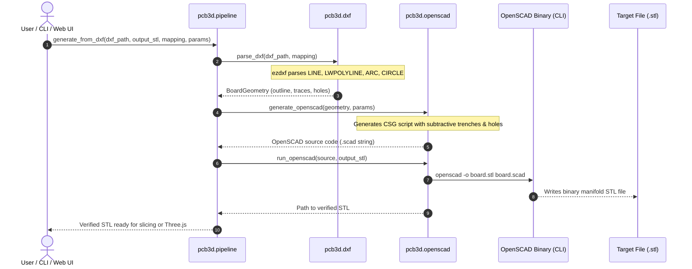

# PCB3D Agent & Developer Architecture Guide

This document is the authoritative engineering guide for autonomous agents and contributors working on the **PCB3D** codebase. It explains the project purpose, architecture, geometric conventions, CSG modeling principles, API contracts, testing protocols, and agent operational constraints.

---

## 1. System Overview & Core Mission

**PCB3D** is a lightweight Python toolchain that converts standard 2D circuit board exports (AutoCAD DXF generated by KiCad or other EDA suites) into 3D printable PCB substrates in **STL format** via OpenSCAD CSG (Constructive Solid Geometry) compiling.

### Physical Concept
Traditional PCBs use etched copper laminates on FR4. A 3D-printed PCB substrate produced by PCB3D creates:
1. **Substrate Base Plate**: A rigid solid dielectric rectangular slab of specified thickness (`base_thickness`, typically 1.6 mm).
2. **Subtractive Copper Trenches**: Recessed channels/grooves (`trace_height` or `trace_depth`, typically 0.4 mm) carved directly into the top surface of the substrate. Traces are **not** raised ridges; they are trenches designed to be filled with conductive ink, wire, electroplated copper, or solder paste.
3. **Through-Holes**: Cylindrical voids (`NPTH`, `Drill`) penetrating completely through the substrate for component pins, vias, and mounting hardware.

```
                  Top Surface (z = base_thickness)
    ────────┐           ┌──────────────┐           ┌────────
            │  Trench   │              │  Trench   │
            └───┬───────┘              └───┬───────┘
                │ <── Trench Depth (trace_height)  │
    ────────────┴──────────────────────────┴──────────────── (z = 0)
                <─────── Solid Base Substrate ─────────────>
```

---

## 2. Agent Operational Protocols & Rules

Whenever an agent operates in this repository:

1. **Virtual Environment Prerequisite**:
   - Always load the environment located in `./.venv/` prior to running any Python command.
   - Command pattern: `./.venv/bin/python ...` or `./.venv/bin/pytest ...`.
2. **Session Logging Requirement**:
   - Maintain a running session log in `/session_log/[YYYY_MM_DD_SESSION.md]`.
   - Log all tasks, hypotheses, fixes, patches, and command executions chronologically.
3. **OpenSCAD Dependency**:
   - The toolchain requires OpenSCAD (binary name `openscad` on system `PATH`).
   - OpenSCAD is executed as a headless subprocess compiler (`openscad -o output.stl input.scad`).
4. **Non-Manifold Prevention in CSG**:
   - In OpenSCAD CGAL Boolean subtractions (`difference()`), never create cutting volumes that are coplanar with the substrate boundaries.
   - Hole cylinders extend from `z = -0.1` to `h = base_thickness + 0.2`.
   - Trench cutters start at `z = base_thickness - trace_height` and extrude with height `trace_height + 0.1` to overshoot the top surface into empty space.
5. **STL Export Integrity**:
   - The STL file compiled and delivered to the user via the CLI or web UI download link (`/stl/<filename>`) is generated strictly by OpenSCAD as a single-body, manifold, colorless geometric substrate.
   - All visual styling in the web viewer (surface normal substrate rendering, shiny metallic copper trench floor shader) is applied strictly on the client-side in Three.js for visualization and must NEVER alter the exported STL geometry or introduce separate child bodies/meshes into the downloaded file.

---

## 3. Repository Architecture & File Map

```
3d_printed_pcb/
├── .venv/                      # Python virtual environment (MANDATORY)
├── session_log/                # Daily session activity logs
│   └── YYYY_MM_DD_SESSION.md
├── src/
│   └── pcb3d/
│       ├── __init__.py         # Package namespace root
│       ├── __main__.py         # CLI entry point (`python -m pcb3d`)
│       ├── cli.py              # Argparse CLI implementation
│       ├── config.py           # YAML configuration & LayerMapping dataclass
│       ├── dxf.py              # DXF parsing & entity extraction via ezdxf
│       ├── models.py           # Pure geometric dataclasses & parameter validation
│       ├── openscad.py         # OpenSCAD source generator & compiler subprocess runner
│       ├── pipeline.py         # High-level orchestration pipeline (dxf/svg -> stl)
│       ├── samples.py          # Programmatic sample circuits (e.g. DIP-8 555 board)
│       ├── svg.py              # SVG parsing & path vector extraction (KiCad SVG)
│       ├── web.py              # Flask server and JSON/STL REST endpoints
│       ├── templates/
│       │   └── index.html      # Single-page studio UI (Three.js WebGL viewport)
│       └── static/
│           └── css/style.css   # Dark glassmorphic interface styles
├── tests/
│   ├── test_core.py            # Geometry, config, DXF, OpenSCAD, and STL unit tests
│   └── test_web.py             # Flask API endpoints and catalog tests
├── Dockerfile                  # Container definition with OpenSCAD & Gunicorn
├── docker-compose.yml          # Production & dev orchestrator with volume persistence
├── .dockerignore               # Build context exclusions
├── pyproject.toml              # Build config, dependencies (ezdxf, pyyaml, flask, gunicorn, pytest)
├── README.md                   # User-facing summary & comprehensive installation guide
├── GEMINI.md                   # Governance and workspace behavior rules
└── AGENT_GUIDE.md              # This engineering document
```

---

## 4. Architectural Data Flow

The entire lifecycle from DXF upload to rendered 3D substrate follows a strict linear unidirectional flow:



---

## 5. Core Module Reference

### `pcb3d.models`
Defines dependency-free, immutable data structures:
- `Point(x, y)`: 2D coordinate in millimetres.
- `Polyline(points, closed)`: Ordered sequence of points representing an outline boundary or trace centerline.
- `Hole(center, radius)`: Circular through-hole or mounting hole.
- `BoardGeometry(outline, traces, holes)`:
  - `bounds`: Returns `(min_x, min_y, max_x, max_y)`.
  - `size`: Returns `(width, depth)`.
  - `translated_to_origin()`: Shifts all coordinates so `min_x = 0` and `min_y = 0`.
  - `connect_traces_to_holes(snap_tolerance)`: Connects open trace endpoints within `(hole.radius + snap_tolerance)` directly to the nearest through-hole center.
- `GenerationParameters`:
  - `base_thickness`: Substrate slab thickness in mm (default: `1.6`).
  - `trace_height` (aliased as `trace_depth`): Trench depth carved into top surface (default: `0.4`).
  - `trace_width`: Width of the routed channel (default: `0.4`).
  - `outline_margin`: Padding added uniformly to all outer edges (default: `0.0`).
  - `snap_tolerance`: Maximum distance beyond hole boundary to snap trace endpoints into hole centers (default: `0.5`).
  - `validate()`: Enforces finite positive numbers and `trace_height < base_thickness`.

### `pcb3d.config`
- `LayerMapping(outline, traces, holes, parameters)`:
  - Configures layer names expected in the DXF file.
  - Defaults: `outline=("Edge.Cuts",)`, `traces=("F.Cu",)`, `holes=("NPTH", "Drill")`.
  - `accepts(category, layer)`: Helper for membership checks.
- `load_config(path)`: Parses YAML file into `LayerMapping`.

### `pcb3d.dxf`
- Uses `ezdxf` to inspect the modelspace entities.
- Extracts:
  - Outline from `LINE`, `LWPOLYLINE`, `POLYLINE`, or `ARC` on outline layers.
  - Traces from `LINE`, `LWPOLYLINE`, `POLYLINE`, or `ARC` on trace layers.
  - Holes from `CIRCLE` on hole layers.
- Automatically discretizes arcs into polylines with angular chord tolerance.

### `pcb3d.openscad`
- `generate_openscad(geometry, parameters)`:
  Emits human-readable OpenSCAD code with CSG subtraction:
  ```openscad
  // Generated by pcb3d; units are millimetres.
  base_thickness = 1.60000;
  trace_height = 0.40000;
  trace_width = 0.40000;

  difference() {
    cube([width, depth, base_thickness]);
    union() {
      // Holes cutting completely through
      translate([x, y, -0.1]) cylinder(h=base_thickness + 0.2, r=rad, $fn=48);

      // Recessed trace trenches
      translate([0, 0, base_thickness - trace_height])
        linear_extrude(height=trace_height + 0.1)
        union() {
          hull() {
            translate(p1) circle(d=trace_width, $fn=24);
            translate(p2) circle(d=trace_width, $fn=24);
          }
        }
    }
  }
  ```
- `run_openscad(source, output_stl, executable, work_directory)`:
  Writes `.scad` to disk, executes OpenSCAD via `subprocess.run()`, checks return codes and output file existence/size, and returns `Path(output_stl)`.

### `pcb3d.svg` (SVG Vector Ingestion)
- Parses Scalable Vector Graphics (`.svg`) files generated by KiCad (`File -> Export -> SVG...` or `File -> Plot -> SVG`) using standard library `xml.etree.ElementTree`.
- Converts physical SVG length units (`mm`, `cm`, `in`, `pt`, `px`) and `viewBox` coordinates to normalized millimetres.
- Traverses layer groups (`<g id="...">` / `<g class="...">`), recognizing KiCad naming variations (`Edge.Cuts`, `Edge_Cuts`, `F.Cu`, `F_Cu`, `Drill`, `NPTH`).
- Extracts vector shapes: `<path>` (discretizing lines, cubic/quadratic beziers, and W3C elliptical arcs), `<rect>`, `<circle>`, `<line>`, `<polyline>`, `<polygon>`, and circular drill hole paths.
- Inverts SVG $Y$ coordinates to map from SVG screen space ($+Y \downarrow$) to CAD/DXF Cartesian space ($+Y \uparrow$).

### `pcb3d.web` & Web UI
- Flask app created via `create_app()`.
- Endpoints:
  - `GET /`: Renders UI with 2D circuit viewer and 3D mesh viewer.
  - `POST /api/dxf-preview`: Multipart upload accepting `dxf` file, `mapping`, `snap_tolerance`, `trace_width`, and `include_m4`. Returns JSON normalized geometry (`bounds`, `size`, `outlines`, `traces`, `holes`, `stats`) for immediate 2D vector inspection without waiting for 3D compilation.
  - `POST /api/generate`: Multipart upload with `dxf` file and parameter form data (`base_thickness`, `trace_height`/`trace_depth`, `trace_width`, `outline_margin`, `snap_tolerance`, `include_m4`, `mapping`, `openscad`). Automatically excludes the `NPTH` layer when `include_m4=0`. Returns `stl_url`, `scad_url`, `job`, and 2D `dxf` geometry.
  - `GET /stl/<filename>`: Serves compiled STL with `model/stl` MIME type.
  - `GET /scad/<filename>`: Serves generated OpenSCAD source file with `application/x-openscad` MIME type as a file attachment for direct download.
  - `GET /api/stack-zip/<job>/<file_type>`: Bundles all generated `.stl` or `.scad` files for a multi-layer stack job into an in-memory `.zip` archive delivered as an attachment.
  - `GET /api/samples`: Lists available circuit board presets.
  - `GET /api/sample-dxf?id=<id>&m4_holes=<bool>`: Returns generated sample DXF on the fly.
- Front-end architecture:
  - **Download Card (`#download-card`)**: Provides dynamic dual download actions: in single-layer mode or when an individual layer is selected, downloads that specific `.STL` and `.SCAD` file; when `ALL` is selected in multi-layer mode, offers one-click downloads for all STLs (`pcb3d_stack_stls.zip`) and all OpenSCAD files (`pcb3d_stack_scads.zip`).
  - **Split Viewports Column (`.viewports-column`)**:
    - **Fluid Responsive UI Scaling**: Both 2D and 3D viewport interfaces utilize CSS `clamp()` scaling based on viewport width (`vw`) for toolbars, action buttons, layer pills, HUD stat badges, navigation hints, empty state overlays, and the 3D ViewCube.
    - **Top Pane (`.dxf-viewport-pane`)**: 2D DXF/SVG Circuit Visualizer rendered via SVG. Maps DXF Cartesian coordinates to SVG with $Y$-inversion to preserve standard CAD top-down orientation. Features responsive layer visibility pills (`Outline`, `Traces`, `Holes`), 2D layer level switcher (`#dxf-layer-nav` with `ALL` and `.dxf-stack-btn` pills) for toggling between stacked board layers or viewing all layers simultaneously (`renderDxf2DAll`) with distinct high-contrast color-coded traces (L1 cyan, L2 amber, L3 emerald, L4 rose...), aligned through-hole via tags, pan/zoom with mouse drag & scroll, hover tooltips for pad/hole diameters, and HUD stats.
    - **Splitter Divider (`.viewports-divider`)**: Draggable divider allowing dynamic reallocation of vertical space between 2D and 3D panes.
    - **Bottom Pane (`.viewport-container`)**:
      - **Studio Lighting & Tonemapping**: Employs `THREE.LinearToneMapping` with `toneMappingExposure = 1.35` for balanced, bright pixel luminance. The light rig features a camera-parented **headlight** (`THREE.DirectionalLight(0xffffff, 1.4)`) for angle-independent frontal illumination, `THREE.AmbientLight(0xffffff, 2.2)`, `THREE.HemisphereLight(0xffffff, 0x64748b, 1.8)` for rich sky/ground ambient fill, high-intensity key/rim directional lights, and an underside bounce light for through-hole cavity clarity.
      - **Substrate Material Modes**: Supports toggling between **Surface Normals** (`MeshNormalMaterial`, default) and **PCB Green** (`MeshStandardMaterial` solder mask finish, `color: 0x166534`, `roughness: 0.32`) via toolbar color swatches. In both modes, trench floors are automatically segmented from the STL geometry ($N_y > 0.85$ and $0.05 < Y < \text{substrateTop} - 0.35 \times \text{traceDepth}$) and rendered with polished **Shiny Copper** (`MeshStandardMaterial` with `color: 0xfa8a4b`, `metalness: 0.90`, `roughness: 0.15`, `clearcoat: 0.40`). For layers with protruding corner alignment pegs, `substrateTop` is dynamically isolated from `baseThickness` so the flat substrate top surface is never erroneously painted with copper.
      - **Interactive 3D ViewCube (Orientation Gizmo)**: Dedicated secondary WebGL renderer (`cubeRenderer`) and orthographic camera (`cubeCamera`) rendering an interactive orientation cube onto `#viewcube-canvas` (fluid size `clamp(96px, 7.5vw, 136px)` with dynamic `ResizeObserver` buffer resizing). Features front-facing normal projection proximity fallback hit-detection for effortless face clicking, real-time orientation synchronization with the main camera, and smooth cubic ease-in-out camera tweening (`startCameraTween`). Includes `#btn-viewcube-home` to reset camera to isometric view.
      - **Multi-Layer Stacking Architecture**:
        - **Sidebar Mode Switcher & Complete Reset**: Toggles between Single Layer and Multi-Layer Stack mode. Switching modes triggers `resetAllState()`, which disposes all 3D meshes, restores the empty overlay, clears the 2D visualizer canvas, resets layer navigation, clears and hides download links, resets file inputs, and creates fresh blank layer slots.
        - **Dynamic Layer Reordering**: Allows interactive upward/downward reordering of layers. Layer roles are automatically derived from the physical assembly sequence (`bottom` = base plate with top pegs, `middle` = inner layer with bottom sockets and top pegs, `top` = cap layer with bottom sockets).
        - **Concentric Via Alignment**: `generate_multilayer_stack()` aligns all layers to a shared bounding origin so through-hole vias across all boards align perfectly in vertical Cartesian space.
        - **Right-Side 3D Vertical Discrete Ruler & 2D Level Synchronization**: Features an interactive vertical discrete elevation ruler (`#stack-ruler-widget`) docked on the right side of the 3D visualizer below the top toolbar. Contains CAD tick notches ordered physically from top of stack (`L2`, `+1.6mm`) to bottom (`L1`, `0.0mm`) plus `ALL`. Fully synchronized bidirectionally with the 2D Circuit Visualizer toolbar (`#dxf-layer-nav`): selecting `ALL` displays all layers in both 2D and 3D with ZIP download actions; selecting an individual layer isolates that layer in 2D and 3D with direct file downloads.
        - **Geometry Serialization**: `board_geometry_to_dict()` in `web.py` ensures every layer returned by `/api/generate-stack` contains complete 2D geometry (`bounds`, `size`, `outlines`, `traces`, `holes`, `stats`) for flawless vector rendering without `undefined bounds` errors.
        - **M4 Mounting Holes Policy**: M4 mounting holes (radius $\ge 2.0\,\text{mm}$ / NPTH layer) are currently disabled for multi-layer stack assemblies to prevent physical conflict with corner stacking pegs and sockets.
        - **Object3D Bounding Fitting**: Camera framing (`fitCameraToMesh()`, `setCameraView()`) utilizes `THREE.Box3().setFromObject(obj)` to compute composite bounding boxes across both single `THREE.Mesh` and multi-mesh `THREE.Group` instances.

---

## 6. How to Test & Verify

All testing is automated via `pytest`. Always invoke through `./.venv`:

```bash
# Run complete test suite
./.venv/bin/pytest -v

# Run only core tests
./.venv/bin/pytest tests/test_core.py -v

# Run web API tests
./.venv/bin/pytest tests/test_web.py -v
```

### Verification Checklist for Future Changes
- [ ] `./.venv/bin/pytest` runs with 0 failures.
- [ ] No regression on OpenSCAD binary execution (`test_run_openscad_generates_valid_stl`).
- [ ] Trench depth remains strictly less than `base_thickness`.
- [ ] Trench cutter height includes the `+ 0.1` mm offset to prevent coplanar non-manifold faces.
- [ ] Stacking pegs and sockets maintain press-fit clearance ($\approx 0.15\,\text{mm}$) and non-manifold offsets.
- [ ] Session log updated in `/session_log/`.

---

## 7. Deployment & Container Architecture

### Container Design
- **Base Image**: `python:3.12-slim-bookworm` provides minimal security attack surface and fast startup.
- **OpenSCAD Headless Compiler**: OpenSCAD 2021.01+ runs directly via CLI (`-o <output.stl> <input.scad>`) without an active X11 display server.
- **Production WSGI Server**: Gunicorn is configured with `-w 4 -b 0.0.0.0:5000 --timeout 120 'pcb3d.web:create_app()'`. The 120-second timeout allows adequate execution time for complex CSG boolean difference calculations on boards with hundreds of trace segments.
- **Persistent Volume**: Generated STL, SCAD, and ZIP bundle artifacts are written to `/app/pcb3d-output`, mounted to `./pcb3d-output` on the host machine to prevent container disk exhaustion and allow easy retrieval.
- **Healthcheck**: Built-in container health check verifies that the Flask application responds to HTTP requests at `/` every 30 seconds.


